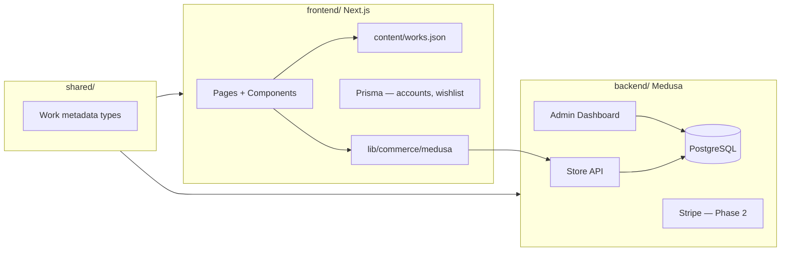

# MIYAKO

A premium platform dedicated to preserving traditional craftsmanship across Asia.

This is a **monorepo** with a strict separation between presentation and commerce:

```
miyako/
├── frontend/     Next.js gallery + accounts (your website — unchanged design)
├── backend/      Medusa commerce API + admin (products, orders, inventory)
└── shared/       TypeScript types shared between frontend and backend
```

The Next.js frontend is never replaced. It reads gallery content from `frontend/content/` and commerce data from the Medusa Store API.

---

## Prerequisites

- **Node.js 20+**
- **PostgreSQL** (Neon recommended)
- **Redis** (optional for local dev; required for production Medusa workers)

---

## Quick start

### 1. Install dependencies

```bash
# Frontend + shared (from repo root)
npm install

# Medusa backend (standalone — do NOT use workspaces)
cd backend && npm install && cd ..
```

### 2. Frontend environment

```bash
cp frontend/.env.example frontend/.env.local
```

Edit `frontend/.env.local`:

| Variable | Purpose |
|----------|---------|
| `AUTH_SECRET` | NextAuth — `openssl rand -base64 32` |
| `DATABASE_URL` | PostgreSQL for accounts, wishlist, order mirror |
| `AUTH_URL` | `http://localhost:3003` |
| `MEDUSA_BACKEND_URL` | `http://localhost:9000` |
| `NEXT_PUBLIC_MEDUSA_PUBLISHABLE_KEY` | From Medusa Admin (after backend setup) |

Push the frontend database schema:

```bash
npm run db:push
```

### 3. Backend environment

```bash
cp backend/.env.template backend/.env
```

Edit `backend/.env` — see [backend/README.md](./backend/README.md) for every step.

### 4. Run both services

Terminal 1 — Medusa (port **9000**):

```bash
npm run dev:backend
```

Terminal 2 — Next.js (port **3003**):

```bash
npm run dev
```

Open:

- Gallery: [http://localhost:3003](http://localhost:3003)
- Medusa Admin: [http://localhost:9000/app](http://localhost:9000/app)

---

## Deploying to Vercel (frontend only)

Vercel hosts the **Next.js gallery**. The Medusa backend is a separate service (Railway, Render, Medusa Cloud, etc.) — it is **not** built on Vercel.

In your Vercel project settings:

| Setting | Value |
|---------|--------|
| **Root Directory** | `frontend` |
| **Install Command** | `npm ci` (runs at monorepo root automatically) |
| **Build Command** | `npm run build` (default from `frontend/package.json`) |

If the Root Directory is left at the repo root, `vercel.json` still runs `npm run build -w frontend` so the Medusa backend is never invoked.

The backend requires a standalone install (`cd backend && npm install`) before `npm run build:backend` — that only runs locally via `npm run build:all`.

---

## Architecture



| Layer | Location | Responsibility |
|-------|----------|----------------|
| **Presentation** | `frontend/` | Gallery UI, i18n, auth, wishlist |
| **Commerce API** | `frontend/src/lib/commerce/medusa/` | Medusa Store API client |
| **Commerce backend** | `backend/` | Products, carts, orders, inventory, admin (standalone npm install) |
| **Shared contracts** | `shared/` | Work metadata schema, currency types, shipping carriers |
| **Content** | `frontend/content/` | Artist/work storytelling (static JSON) |
| **Accounts DB** | `frontend/prisma/` | Users, wishlist, order mirror |

---

## Works vs Products

Medusa internally uses **Products**. MIYAKO calls them **Works** on the website.

- **Gallery storytelling** stays in `frontend/content/works.json`
- **Commerce** (price, inventory, checkout) comes from Medusa
- Each Medusa product carries **Work metadata** (bilingual titles, artist, technique, etc.) in `product.metadata` — see `shared/src/work-metadata.ts`

When creating a product in Medusa Admin, set:

- **Handle** = SEO slug (matches `works.json` slug)
- **Metadata** = Work fields (titleJa, artistName, region, oneOfAKind, etc.)

---

## Payments & shipping (prepared)

- **Stripe**: Architecture ready in `backend/medusa-config.ts`. Set `STRIPE_API_KEY` in Phase 2.
- **Shipping**: EMS, DHL, FedEx, UPS stubs in `backend/src/modules/fulfillment/`. Live rates in Phase 2.
- **Checkout**: Buy button creates a Medusa cart → `/checkout` page. Full payment UI in Phase 2.

---

## Scripts

| Command | Description |
|---------|-------------|
| `npm run dev` | Start Next.js frontend (3003) |
| `npm run dev:backend` | Start Medusa backend (9000) |
| `npm run build` | Build frontend (Vercel / production gallery) |
| `npm run build:all` | Build backend + frontend (local full stack) |
| `npm run db:push` | Push Prisma schema (frontend DB) |

---

## Documentation

- [Backend setup (step-by-step)](./backend/README.md)
- [Shared types](./shared/src/)

---

## Removed

Shopify integration has been fully removed. Commerce now flows through Medusa only.
